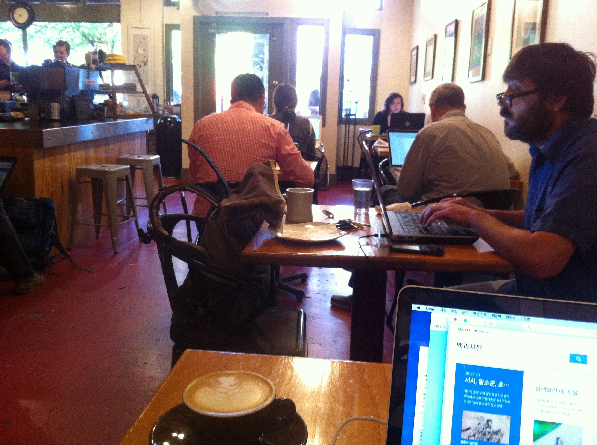

###장면 1 : 강남역 스타벅스 
    
    
    
    
######강남역 10번출구 대로변 뒷골목에 있는 스타벅스. 주변의 스타벅스들이 가게세를 이기지 못하고 다 없어져버린 지금에도 이 매장만큼은 내가 처음 방문했었던 2004년 초이래로 여전히 굳건히 자리하고 있다. 하지만 지난 11월 지원씨와 그녀의 친구와함께 술을 마신 뒤 다시 들르기까지 방문한 적이 거의 없었다. 홀로 드나들기에 강남역은 지독한 인파로 극성스러운 장소기 때문이다. 

최근에 다니게 된 미술학원이 이곳에 위치하지 않았다면 여기에 올 일은 없었을 것이다. 최근에는 늘상 애엄마들이 많은 성복동이나 분당의 까페정도만 다니다보니 지금같이 이십대중반들이 몰리는 이런 까페의 평일 분위기가 왠지 새롭다. (내 또래는 확실히 없다. 물론 여기보다 조금 더 동측에 있는 테헤란로나 여의도, 혹은 늦깎이 고시생들이 있는 노량진에서는 점심시간대에 제법 볼 수 있긴 하겠지만. 물론 나와 처지가 매우 달라 나이대의 유사함이 별달리 유의미한 동질감을 갖기 어렵겠지만 말이다) 갑자기 확 올라버린 광역버스요금탓에 분당선을 타고 이곳까지 왔다. 

근데 열한시대의 전철은 왜 그렇게도 혼잡한지. 예의 노인들이 칸칸마다 적어도 삼분지 일이상씩 차지하고있는 가운데 어느 역엘 가도 내리는 사람보다 타는 사람이 많아 선릉역까지 내내 만원이었다. 역시 나 같은 생각으로 전철에 오른 사람이 많은걸까? 버스에 비해 강남역까지 무려 700원을 아낄 수 있기 때문이다. 비록 버스보다 소요시간이 적어도 사십 분 이상 더 들긴 하지만. 

열두시 삼십분의 이곳 스타벅스는 이미 사람들로 바글바글했다. 그리 작은 매장이 아니지만, 방학이라 그런지 이 일대에 밀집한 외국어학원의 수업을 기다리는 학생들일 가능성이 높았다. 대개 토익이나 영어교재를 펼쳐들고 문제를 푸는 류가 있는가하면, 나처럼 어떤 목적에서건 스마트폰을 들여다보고 있든가, 노트북을 앞에다 두기도 한다. 소수는 책을 읽거나 신문(간혹가다 영자신문도)을 펼쳐놓기도 하며, 호기롭게 영어로 대화를 나누는 무리도 눈에 띈다. 물론 여자끼리 모여 수다를 떠는 류도 상당히 많다. 강남역은 역시 다르군. 시간대별로 혼잡도가 극적으로 차이나는 여의도나, 오전시간대는 아늑하게 한산한 광화문일대와는 사뭇 다른 모습이다. 

내가 *잃어버린 시간을 찾아서*를 읽고 있었을 때, 저편에서 웬 여자가 두리번거리며 자리를 찾고 있었다. 그러나 역시 마땅한 자리를 찾을 수 없었는지, 결국 둥근테이블에 의자 하나만 덜렁 놓여있는 내 옆자리에 앉는 수밖엔 선택의 여지가 없었다. 근데 바로 그 무렵, 그 자리의 한시방향 벽쪽에 의자가 네개나 딸린 자리에 있던 여자가 일어나려는 기척을 보이기 시작했다. 그러자 내 옆테이블의 여자가 그쪽을 신경쓰며 자신의 짐을 풀어놓지 않은 채 기다리는 품을 취했다. 테이블 크기는 같았지만, 벽쪽이라 사방이 다른 테이블에 둘러싸여 다소 산만한 느낌이 드는 지금의 자리보다 나으리라고 판단한 것이다. 그러나 벽쪽의 여자는 먼저 휴지따위를 휴지통에 버리려 한번 움직이고, 멀티코드를 정리하고, 화장실엘 갔다오는지 다시 한번 자리를 뜨고, 또 한 차례 전화를 받는지 어쩌는지 또 움직이기를 반복했다. 옆테이블 여자는 그 동작의 반복을 처음엔 차분하게 기다리는 듯하며 이제는 정말 가나보다, 싶어 반기다가 지쳐 그냥 그대로 자세를 풀어버리는 모양새를 취했다. 그러나 짐을 펼치지는 않은채였다. 곧 맞은 편에 그 여자의 친구가 도착했다. 

여자가 입을 열었는데, 목소리가 매우 가냘프고 높은 톤에, 지나치게 애교스러운 티가 강한 것이 남규리를 연상케했지만 그보다 더 인위적이고 교태스러운 느낌이 들었다. 두 여자는 일단 이 시간대의 스타벅스가 왜 이렇게 번잡한 지에 대한 불만으로 대화를 시작했다. 여자의 친구는 마치 이 장소의 본질을 제 스스로 정의내리겠다는 듯 단정적인 말투로 "여기 완전 도서관이네"를 몇번이고 반복하며 마치 자기네들을 둘러싼 이 사람들이 까페의 존재의미에 걸맞지 않은 행동들을 한 채 죽치고 있다는 양 짜증스러움을 드러내되, 그것을 불만스럽다기보다는 비교적 차분하면서도 냉소적인 기운이 역력한 말투를 통해 마치 이 장소의 외부로부터 이 장소를 규명하고 이 장소의 방문객들을 평가하는 태도를 취하고 있었다. 이에 여자는 적극적으로 공감을 표하며 "자리가 별로지? 여기 사람들이 혼자 와서 테이블을 두개 세개 차지하고 있으니까 앉을 자리가 없더라."라고, 아주 분명하고 작지 않은 목소리로-친구만큼이나 선언적으로, 주목하라는 듯- 주변의 '홀로 온 사람들'을 원망했다. 이어 그들은 구렁이 담 넘어 가듯 태도를 바꾸어 스타벅스 커피를 좋아하지는 않지만 쿠폰때문에 왔다는 둥 어차피 다른 데 가도 마찬가지라는 둥 하면서 아까의 대화가 마치 자신들은 이 공간에 들어온 갑남을녀들과는 다르다는 양의 뉘앙스로 가득했던 대화를 중화시키는 듯했다. 그리고는 다시, 좋은 자리 생기면 빨리 옮겨야 한다, 오늘 오래 머물 생각으로 오지 않았느냐하며 대화를 이어갔다.

이윽고 친구는 이윽고 최근의 자신의 즐거움을 여자에게 전파하고자하는 열망을 이기지 못하겠다는 듯 다소 열띤 목소리로 '자 이거 들어봐 내가 요새 엄청 빠진 베를리오즈의 환상교향곡 2악장이야...좋지 않니? 마치 무도회장에 온 듯한 기분이야.."하며 말을 건넸다. 이제껏 쭈뼛쭈뼛한 태도를 유지하던 여자는 친구를 만나는 순간부터 이미 자신의 태도를 바꾸기 시작하였는데, 친구가 자신의 관심사를 털어놓는 순간 더욱 가속적으로 그 외양을 보다 소녀스럽게 취하였다. 뭐랄까 친구의 존재가 그녀로 하여금 일종의 안정감을 부여하고, 그 둘의 대면을 통해 비로소 물 만난 물고기가 된 듯, 혼자 앉아 있을 때는 짐작도 하지 못했던 무언가 연극적인 느낌의 어조와 동작을 시시각각 선사하기 시작했다. 그리고 친구가 건네준 이어폰을 귀에 꽂는 순간 여자는 선율에 몸을 싣는듯 앉은 채로 상체를 흔들흔들거리며 콧노래를 부르기 시작하고, 예의 그 콧소리 심한 목소리로 감상을 표한다. 하지만 베를리오즈가 어느 시대 사람인지 몰라 친구의 음악에 대한 설명의 와중에 '마녀사냥'이라는 말이 섞여 나오자 대뜸 "르네상스적인 음악을 하는 사람이네"라고 말하지만, 대화를 통해 음대생임이 드러난 친구가 시대를 고쳐주었다. 

"아" 애상을 띤 어조로 여자가 말했다.  
"하고 싶은게 너무 많아. 음악도 배우고 싶고... 난 바이올린을 배울거야. 어렸을 때부터 내 손이 바이올린 할 손이라는 얘길 많이 들었어... 미술도 해야지. 하지만 음악이 더 좋아"하며 집안에서 요리삼매경에 빠지다지쳐 감상에 젖은 채 디저트 대신 예술연하는 주부의 태도를 보여주었다.