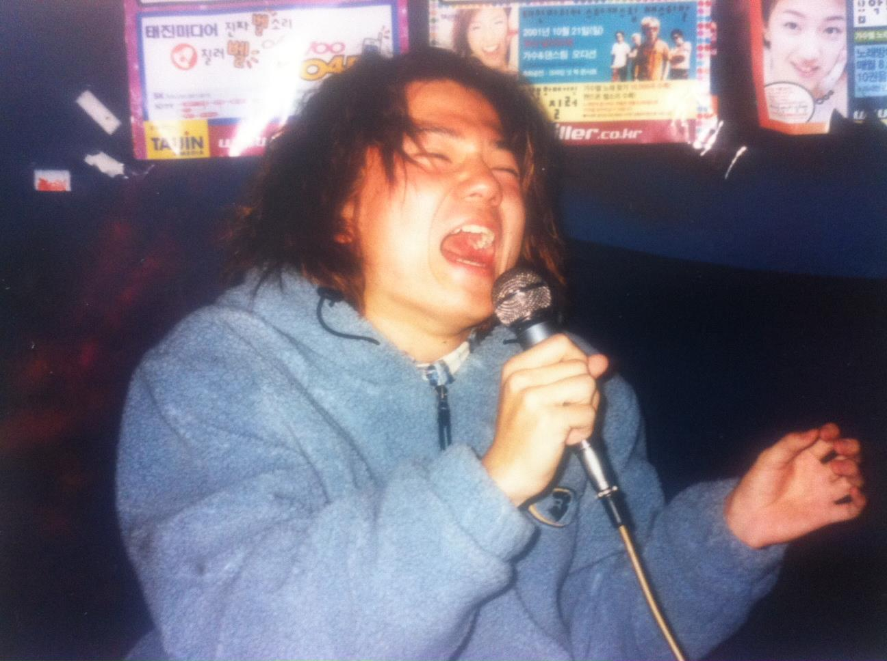

# 노래를 불렀네

집에서 나오는 길에 나는 갑자기 비틀즈의 노래가 듣고 싶어 '렛잇비'를 틀어서 듣기 시작했다. 그리고 그 노래의 후렴구 '렛잇비, 렛잇비, 렛잇비, 렛잇비~'하고 읊조리는 구절을 따라부르는데, 내 기대보다 부드럽게 잘 뽑아져 나와 기분이 좋아졌다. 고음이 억지스럽게 나오면 전혀 '렛잇 비'스러워보이지 않기 때문이다. 요새 나는 지난 시간동안 수련해온 복식호흡의 효과를 느껴보고자 노래를 부르며 배에서 소리가 나는지 안나는지를 확인하고는 한다 아니 그 순서가 바뀌었다. 실은 노래를 부르다 예전보다 배쪽에 힘이 좀더 실리는 듯한 느낌을 받고는 하는데, 그때마다 나는 이게 그간 요가와 108배를 하면서 의식적으로 애쓰던 복식호흡의 효과라고 믿어버린다. 그러나 실제 내가 복식호흡을 완전하게 수행하고 있는지는 확신하지 못하겠다. 즉 호흡이 단전까지 내려와 머문 뒤 다시 찬찬히 기도를 따라 올라 내뱉어지는 그 과정이, 매번 제대로 되는 것 같지는 않다. 다만 애쓰곤 있으니 아예 안 할때보다는 다소 향상되지 않았을까 혼자 기대할 뿐이다. 하지만 노래를 부를 때보면, 그것을 좀 확신할 수 있다. 예전엔 오로지 목으로만 소리내어 특히 고음을 낼 때면 내가 듣기에도 딱할 정도였는데, 지금은 이따금 감정이 실려 고음의 분위기를 고조시킨다고 혼자 확신하기도 한다. 꼭 고음이 아니더라도 멜로디가 단지 음의 높낮이를 분별해보이기 위해서 목으로 나오는 것이 아니라, 감정을 드러내기 위한 풍부함이 실리기도한다는 것이다.(그렇게 연출해내고 있음을 자족하며 유난히 과장하고 힘이 들어가는 단점은 논외로 하고) 그런데 멜로디 안에 그런 풍부함을 깃들이기 위해서는 목이 아니라 뱃심이 필요하다는 걸 느꼈다. 예전에는 배에 소리를 내겠답시고 배에 잔뜩 의식을 주고 노래를 시도한 적이 있는데 오히려 숨이 넘어가 마치 비명을 지르는 것 같은 추한 소리만 나와 부르기를 멈추었다. 그러나 지금은 나 자신도-또는 내 목청도 예상치 못한 발성에 놀라는 수가 있다. 그것은 배에서부터 나오는 소리였다. 그러나 그것이 어떻게 나오는 소리인지는 잘 몰라 연습요령을 알지 못한다. 그럴때면 나는 온갖 노래들을 시도하기 시작해서 나의 표현력을 자평하려고 한다. 마치 산보하는 기분으로, 언니네이발관의 산들산들을 부르며 내 감정표현에 자족하고, 나를 잊었나요, 헤븐은 조금 지루해졌다고 자만한다. 마이앤트메리는 나와 잘 맞는다는 생각을 하다가, 넬을, 줄리아하트를, 불독맨션을 내리 불러 본다. 이어 이적의 '사랑은 어디로'같은 감정선 짙은노래를 부르기도 하고 김동률의 '출발'을 통해 심상한 저음을 시도해보기도 한다. 평소엔 거들떠도 듣지 않는- 감정과잉으로 듣기가 역겹다고 몹시 혐오하던 포맨의 못해같은, 노을의 그리워그리워같은, 내가 한국가요계에서 가장 싫어하는 가수 케이윌의 노래같은 걸 닥치는대로 시도해보다 에프티아일랜드의 지겹도록인지 미치도록인지도 부르기도 한다. 듣지는 않고 부르기만 하는 십센치의 아메리카노를(이 노래의 보컬에서 느껴지는 그 잘난척하는, 뽐내는 느낌이 같잖기 때문에. 근데 막상 부르면 그 기분에 도취되어 보컬의 심정에 동의한다) 해보고, 리쌍의 티비를껐네로 1인4역(남자가 하면 소름이 끼칠 윤미래의 파트마저)도 주저않고 불러제끼다, 내가 랩도 좀 되는 것 같다고 착각하며 슈프림팀의 그땐그땐그땐을 라임도 파악하지 못한 상태에서 재는 듯한, 껄렁껄렁한 목소리만 내며 부른다. 영준의 보컬을 부르다보니, 듣기에도 부르기에도 (기분상) 무난한 브라운아이드소울에 도달하여 낫씽베러의 가성을, 브라운시티의 리듬감을, 아름다운날들의 서정성에 도전하다 'go'에서의 나얼의 위력적인 발성에 굴복하여 아직은 시기상조라는 결론을 이끌어낸다. 그리곤 내가 그렇게 노래를 괴성으로만 부르지 않음을 스스로에게 증명하고자 쓸데없이 세븐의 노래를 못해도를 부르며 박진영은 늘 똑같구나하는 생각을 한다. 자연스레 팝으로 넘어가, 부르기에 깔끔한 웨스트라이프의 이프아이렛고, 스웨어잇어게인을 부르기도 하고 플라잉위드아웃윙스에선 순간적으로 감정을 터뜨리는 까다로운 고음을 실감한다. 제임스모리슨의 어딘가 신경질적인 보컬은 나중에 더 연마해보고 싶은 목소리라고 생각하다가 다미엔 라이스가 결코 만만한 보컬이 아니라는 것, 막시밀리안헤커의 침울함이나 존레전드의 스모키한 보이스컬러는 내 목소리와 전혀 어울리지 않다는 사실을 깨닫고는 대니얼파우터로 넘어가, 그의 배드데이를 부르며 언젠가 내가 훨씬 잘 부를 수도 있는 노래라고 기대한다. 그리곤 도트리의 왓어바웃나우를 부르며 내가 제법 잘 부른다고 생각한다. 그러면서 멜랑콜리한 면이 없을 뿐 아마도 도트리가 영향을 지대하게 받았으리라 추측하는 니클백의 채드 크뢰거도 부를 수 있지 않을까 기대하며 포토그래프를 불렀더니, 아 이건 경우가 다르구나 하는 걸 뼈에 공명하는 쉰소리를 통해 깨닫는다. 기가 죽은 나는 별안간 샬롯 갱스부르의 5:55를 부르기도 하고(이것은 마치, 혼자 있을 땐 찐득한 코딱지의 냄새를 맡는 정도가 아니라, 심지어 똥구멍의 털을 뽑아 그 끝가닥을 살펴볼 정도로 별 짓을 다하는 인간의 습성을 상기시키는 대목이다.), 아델의 내 마음에 불났네하는 구절로 시작하는 롤링인더딥을 톤다운시켜 부르며 여자였으면 이런 노래도 자주 불렀겠거니 생각한다. 이 모든 노래를 밤 11시대의 내 방에서 부르는 일이 종종 있는데, 오아시스의 원더월(그 특유의 시니컬한 음색을 최대한 살려가며)을 거쳐 라디오헤드의 하이앤드라이를 부르며 의기양양해진 내가, 크립의 클라이막스 비명(런~ 하는 부분)에 이를 즈음, 이로 인해 아랫층을 의식하는 엄마의 부담과 걱정은 고조되어 방문을 열고 얼굴 상의 모든 주름을 동원하여 이 모든 지랄발광을 중단할 것을 간곡히 호소하거나, 혹은 거실에서 휴대폰으로 '그만! 노래 그만!'이라는 문자를 보내오기도 한다. 이 순간 나는 격연 끝에 피아노뚜껑을 덮는 하노 부덴브로크의 허무에 가득한 심정을 떠올리며 기세가 죽지만, 이 따위에 지지 않으려는 듯 엄동설한의 바깥으로, 가로등 하나 켜지지 않는 공원으로 나가 다시 노래를 부른다. 그런데 너무 추워서 잘 부르든 못 부르든 조금도 개의치 않던 목청의 기세가 꺾이고, 흥도 나진 않는다. 이렇게 노래를 불러댄다 하여 내가 무슨 슈퍼스타케이에 나가겠다는 건 아니다. 전혀, 그런 욕망은 꿈에도 없다. 혹여나 지금 쟤가, 하는 우려라도 하시는 분들은 걱정일랑 붙들어 매시길. 그저 무슨 설움이 복받치는지, 이런것도 아니라 늦바람에 신명이 돋아 벌이는 소소한 일거리일 뿐. 하지만 집 앞에 폭포라도 있으면 옆에서 지지 않고 피를 토하는 심정으로 악다구니를 질러대, 마침내 득음이라도 할거라고 나는 생각한다. 우리의 도시는 어딜가나 시끄럽지만, 정작 큰 소리를 질러댈만한 공간은 그다지 많지 않은게 사실이라.